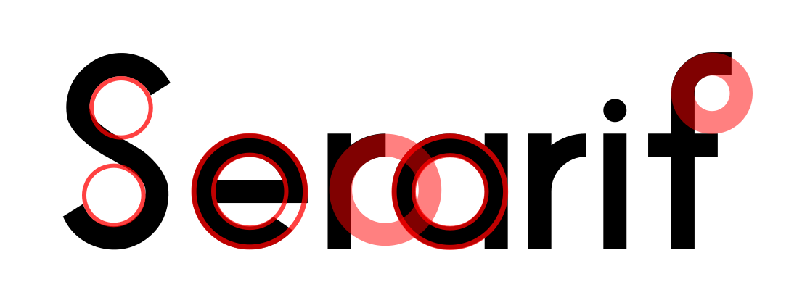
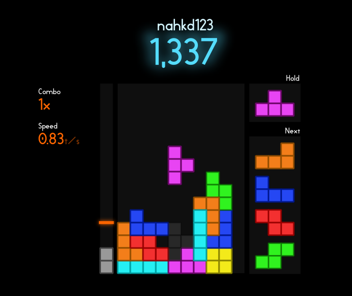

# Serarif

Welcome to Serarif, my first typeface ever! This typeface was orignally designed just for fun, but now I decided to use it in my projects (which also helps me transition from monospace).

## Like this font?
- "Source code" is [available on GitHub](https://github.com/nahkd123/Serarif)
- Downloads at [releases page](https://github.com/nahkd123/Serarif/releases)
- Suggestions are welcomed and can be submitted via [issues page](https://github.com/nahkd123/Serarif/issues)

## Overview
Serarif is a sans-serif typeface. Each line has constant thickness and squared at the caps.

The typeface itself was made from simple shapes like rectangles and circles (ellipse on some glyphs like ``0`` or capital ``O``):

## Serarif in use
### Video games
Serarif looks decent on competitive game interfaces (well it looks great on my eye, but probably not for you):

