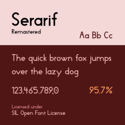

# Serarif


Yet another web font (not sure if it is looks good or bad)

## Working with the font
I used [Inkscape](https://inkscape.org/) to create glyphs and [FontForge](https://fontforge.org/en-US/) to combine all SVG files into ``.sfd`` file. Both of them should works on all 3 desktop platforms (Windows, Linux and Mac). However, you only need FontForge to edit the font.

Directories structure:
- ``docs/``: Documentations
- ``svgs/``: Inkscape files (or SVGs)
  - ``Latin/``: Latin characters (A, b, c, etc.)
  - ``Symbols/``: Regular symbols like ``!@#$%^&`` and more
  - ``Regional/``: Characters based on region (Eg: ``Regional/Asia/Chinese``)

## Generating font
You can generate the font in 2 ways:

### 1. Using FontForge GUI
Open the ``Serarif.sfd`` in FontForge, then click ``File > Generate Fonts``. Choose the destination, then click ``Generate``.

If you use ``TrueType``, you might get a message related to EM size (where it must be the power of 2). You can safety ignore that for now

### 2. Using FontForge CLI
In some cases where you can't access to display device (let's say you're running on Linux without X11 server), you can use FontForge CLI to generate it:

```sh
fontforge -c 'Open($1); Generate($2)' Serarif.sfd Serarif.ttf
```

## License
Serarif is licensed under [SIL Open Font License](https://scripts.sil.org/cms/scripts/page.php?site_id=nrsi&id=OFL). The license text file should be included in the repository.
